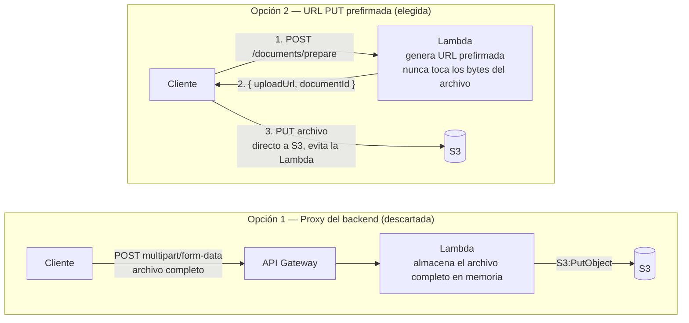

# ADR-005 — Estrategia de Subida de Documentos

**Estado:** Aceptada — motor de almacenamiento actualizado, ver nota abajo.

---

## Decisión

**El frontend sube los documentos directamente a Amazon S3 usando una URL prefirmada (pre-signed) de tipo PUT, de corta duración, generada por el backend.**

**Motor de almacenamiento:** el registro `PENDING` mencionado en este documento se persiste en **Aurora PostgreSQL** (tabla `documento_versiones`), no en DynamoDB — ver [ADR-008](008-data-storage-strategy.md).

---

## Contexto

Los tenants de DocLens suben documentos (en el dominio actual: documentación asociada a un proceso legal — escritos, contratos, pruebas, comunicaciones) que deben llegar a S3 antes de que el OCR y la extracción semántica puedan ejecutarse. Hay dos opciones arquitectónicas para cómo viajan esos bytes del cliente a S3: a través del backend Lambda, o directamente a S3 evitando por completo la Lambda.

El mecanismo de subida es también el primer punto donde debe aplicarse el aislamiento por tenant: la clave de S3 debe incorporar el `tenantId` (equivalente a `empresa_id` en el esquema de datos, ver [ADR-008](008-data-storage-strategy.md)) para que ningún tenant pueda sobrescribir o acceder a los archivos de otro.

---

## Opciones consideradas

### Opción 1 — Proxy del backend (cliente → Lambda → S3)

El frontend envía el archivo por POST a un endpoint de API Gateway. La Lambda recibe los bytes crudos, los valida y llama a `S3:PutObject`.

**Fortalezas**

- Implementación simple del cliente — POST multipart estándar.
- Toda la validación y autorización ocurre en un solo lugar (la Lambda).
- Nunca se otorga acceso directo del cliente a S3.

**Debilidades**

- **Límite duro de payload:** API Gateway HTTP API limita los payloads de solicitud a **10 MB**. El buffer en memoria de Lambda añade presión adicional. Los documentos (PDFs escaneados, contratos multi-página) exceden esto habitualmente.
- **Costo:** los bytes del archivo fluyen a través de API Gateway y Lambda, duplicando los costos de transferencia de datos frente a la subida directa.
- **Latencia:** la Lambda debe almacenar en buffer el archivo completo antes de escribir a S3, añadiendo tiempo de ida y vuelta innecesario.
- **Presión de memoria:** una instancia Lambda manejando una subida grande no puede atender otras solicitudes mientras almacena el buffer.

### Opción 2 — URL prefirmada PUT (cliente → S3 directamente)

El frontend llama a un endpoint ligero del backend (`POST /documents/prepare`) que genera una URL PUT prefirmada de S3 y la devuelve junto con un `documentId`. El frontend hace luego un PUT del archivo directamente a esa URL. La Lambda nunca toca los bytes del archivo.

**Fortalezas**

- **Sin límite de payload:** S3 soporta objetos de hasta 5 TB; la Lambda nunca almacena el archivo en buffer.
- **Costo:** la transferencia de datos va directamente cliente → S3; la Lambda solo se invoca para la llamada corta de metadatos.
- **Aislamiento por tenant impuesto en la generación de la URL:** el backend controla la clave de S3 (`{tenantId}/documents/{documentId}/v{versionNumber}.{ext}`), el tipo de contenido permitido y el TTL de la URL. El cliente no puede desviarse de estas restricciones.
- **Responsabilidades desacopladas:** la Lambda maneja auth y metadatos; S3 maneja el almacenamiento.
- **Patrón estándar** para subidas a S3 en arquitecturas serverless.

**Debilidades**

- Implementación del cliente ligeramente más compleja — dos solicitudes en lugar de una (prepare + PUT).
- La URL prefirmada debe tratarse como un secreto; si se intercepta dentro de su TTL, puede usarse para subir contenido arbitrario a esa clave específica. Mitigado por TTL corto y HTTPS.
- La validación de **tamaño** del archivo no puede ocurrir de forma síncrona antes de la subida (solo después, vía metadatos de S3) — pero el formato sí se valida de forma síncrona: `prepare` valida el `contentType` contra la lista de formatos soportados antes de emitir una URL, de modo que un formato no soportado nunca llega a S3.

---

## Comparación

| Dimensión | Proxy del backend | URL PUT prefirmada |
|---|---|---|
| Tamaño máximo de archivo | ~10 MB (límite de API GW) | 5 TB (límite de S3) |
| Presión de memoria en Lambda | Alta (almacena el archivo completo) | Ninguna |
| Costo de transferencia de datos | Doble (cliente → Lambda → S3) | Directo (cliente → S3) |
| Aislamiento por tenant | En el handler de la Lambda | En la generación de la URL (impuesto por S3) |
| Complejidad del cliente | Simple (una solicitud) | Moderada (dos solicitudes) |

---

## Diagrama — Opción 1 vs. Opción 2



---

## Enfoque elegido

**Opción 2 — URL PUT prefirmada** es el enfoque seleccionado, por las razones de la tabla de [Comparación](#comparacion) anterior: sin techo de payload, sin presión de memoria en Lambda, menor costo de transferencia de datos, y aislamiento por tenant impuesto en el momento de generar la URL.

`POST /documents/prepare` es la única llamada al backend requerida antes de la subida. La llamada:

1. Valida el tenant autenticado (vía middleware de tenant — `tenantId`/`empresa_id` desde el JWT de Cognito).
2. Valida el `contentType` de la solicitud contra la lista de formatos soportados. Formatos no soportados se rechazan con `400 Bad Request` **en este paso** — antes de generar cualquier URL prefirmada.
3. Genera un `documentId` (GUID) si no se provee, o valida que el `documentId` suministrado pertenece al tenant autenticado.
4. Determina `versionNumber` — `1` para documentos nuevos, `latestVersion + 1` para versiones subsiguientes.
5. Construye la clave de S3 usando la extensión mapeada del `contentType` validado: `{tenantId}/documents/{documentId}/v{versionNumber}.{ext}`.
6. Genera una URL PUT prefirmada acotada a esa clave exacta, con un **TTL de 15 minutos** y una restricción de `Content-Type` que coincide con el valor validado.
7. Inserta un registro de versión `PENDING` en **Aurora** (tabla `documento_versiones`, referenciando el `documento_id` — cuyo `empresa_id` vive en la tabla padre `documentos`, ver [ADR-008](008-data-storage-strategy.md)), incluyendo el `contentType` almacenado — la Lambda Processor lo necesita para enrutar la extracción (ver [ADR-003](003-ocr-strategy.md)).
8. Devuelve `{ documentId, versionNumber, uploadUrl, expiresAt }`.

El frontend hace PUT del archivo directamente a `uploadUrl`. Una vez completado el PUT, el procesamiento se dispara automáticamente vía GuardDuty → EventBridge → SQS (ver [ADR-011](011-document-processing-trigger.md)) — el cliente no necesita llamar a ningún endpoint adicional. El cliente sondea `GET /documents/{documentId}/versions/{versionNumber}` para obtener el resultado.

**Convención de clave S3:**

```
{tenantId}/documents/{documentId}/v{versionNumber}.{ext}
```

`{ext}` se deriva del lado del servidor a partir del `contentType` validado — nunca se toma directamente de un nombre de archivo suministrado por el cliente. Esta convención (adoptada en [ADR-007](007-document-versioning.md)) hace que cada versión sea direccionable de forma independiente y soporta la gestión de ciclo de vida por versión.

### Formatos soportados (lista permitida)

| Formato | `contentType` (suministrado por el cliente) | `{ext}` en la clave S3 | Ruta de extracción ([ADR-003](003-ocr-strategy.md)) |
|---|---|---|---|
| PDF | `application/pdf` | `.pdf` | PdfPig → Amazon Textract como respaldo |
| Markdown | `text/markdown` | `.md` | Lectura directa UTF-8 |
| Texto plano | `text/plain` | `.txt` | Lectura directa UTF-8 |
| Word | `application/vnd.openxmlformats-officedocument.wordprocessingml.document` | `.docx` | `DocumentFormat.OpenXml` |
| PowerPoint | `application/vnd.openxmlformats-officedocument.presentationml.presentation` | `.pptx` | `DocumentFormat.OpenXml` |
| Excel | `application/vnd.openxmlformats-officedocument.spreadsheetml.sheet` | `.xlsx` | `DocumentFormat.OpenXml` |
| Imagen PNG | `image/png` | `.png` | Amazon Textract (solo OCR) |
| Imagen JPEG | `image/jpeg` | `.jpg` | Amazon Textract (solo OCR) |
| Imagen TIFF | `image/tiff` | `.tiff` | Amazon Textract (solo OCR) |

El formato binario legado `.doc` (Word pre-2007) **no** está en esta lista — ver la pregunta abierta.

**Restricciones de la URL prefirmada impuestas por S3:**

| Restricción | Valor |
|---|---|
| TTL | 15 minutos |
| Método HTTP | Solo PUT |
| Content-Type | Un valor de la tabla de formatos soportados, fijo por solicitud |
| Clave destino | Clave exacta — sin comodines |

---

## Consecuencias

- **IAM:** el rol de ejecución de la Lambda debe incluir `s3:PutObject` en el bucket de subidas (para generar la URL prefirmada).
- **Aurora:** el registro `PENDING` escrito en el momento de `prepare` permite detectar subidas abandonadas (documentos preparados pero cuyo archivo nunca llegó a S3) para limpieza — ver [ADR-008](008-data-storage-strategy.md) para el esquema.
- **Frontend:** flujo de dos pasos — `POST /documents/prepare` y luego `PUT {uploadUrl}`. El procesamiento se dispara automáticamente después (ver [ADR-011](011-document-processing-trigger.md)), sin una tercera llamada del cliente.
- **CORS:** el bucket S3 debe tener una política CORS que permita PUT desde el origen del frontend.
- **Validación de Content-Type:** se valida contra la lista de formatos soportados en el momento de `prepare` (rechazo temprano, antes de la subida) y se refuerza de nuevo en el propio PUT vía la restricción de Content-Type de la URL prefirmada.
- **`IContentExtractionService`:** esta lista de formatos permitidos es la fuente de verdad que el enrutador de formato de ADR-003 consulta — ambas deben mantenerse sincronizadas si se agrega o quita un formato.

---

## Preguntas abiertas

- ¿El formato binario legado `.doc` está en el alcance de la V1? Está excluido de la lista actual porque no hay una forma limpia de parsearlo (ver [ADR-003](003-ocr-strategy.md#preguntas-abiertas)).
- ¿Cuál es la política de retención para registros `PENDING` a los que nunca les sigue una subida completada (subidas abandonadas)?
- ¿El TTL de la URL prefirmada debería ser configurable por tenant?
- ¿La lista de formatos soportados debería ser configurable por tenant, o basta una lista global única?
