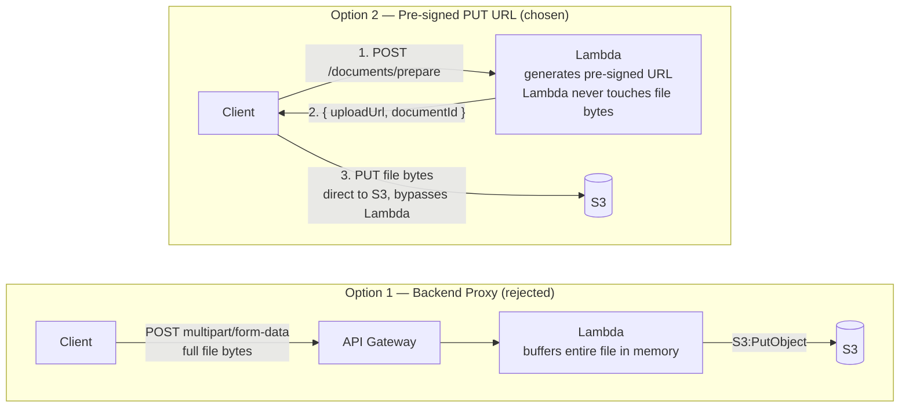

# ADR-005 — Document Upload Strategy

**Status:** Accepted

---

## Decision

**Frontend uploads documents directly to Amazon S3 using a short-lived pre-signed PUT URL generated by the backend.**

---

## Context

DocLens tenants upload documents (invoices, contracts, reports, CVs) that must reach S3 before OCR and semantic extraction can run. There are two architectural options for how those bytes travel from the client to S3: through the backend Lambda, or directly to S3 bypassing the Lambda entirely.

The upload mechanism is also the first point at which tenant isolation must be enforced: the S3 key must embed the `tenantId` so that no tenant can overwrite or access another tenant's files.

---

## Options Considered

### Option 1 — Backend Proxy (client → Lambda → S3)

The frontend POSTs the file to an API Gateway endpoint. The Lambda receives the raw bytes, validates them, and calls `S3:PutObject`.

**Strengths**

- Simple client implementation — standard multipart form POST.
- All validation and authorization happen in one place (the Lambda).
- No direct client access to S3 is ever granted.

**Weaknesses**

- **Hard payload limit:** API Gateway HTTP API caps request payloads at **10 MB**. Lambda's in-memory buffer adds further pressure. Documents (scanned PDFs, multi-page contracts) routinely exceed this.
- **Cost:** file bytes flow through API Gateway and Lambda, doubling data transfer costs relative to direct upload.
- **Latency:** Lambda must buffer the entire file before writing to S3, adding unnecessary round-trip time.
- **Memory pressure:** a Lambda instance handling a large upload cannot serve other requests while buffering.

### Option 2 — Pre-signed PUT URL (client → S3 directly)

The frontend calls a lightweight backend endpoint (`POST /documents/prepare`) that generates a pre-signed S3 PUT URL and returns it along with a `documentId`. The frontend then PUTs the file directly to that URL. Lambda never touches the file bytes.

**Strengths**

- **No payload limit:** S3 supports objects up to 5 TB; the Lambda never buffers the file.
- **Cost:** data transfer goes client → S3 directly; Lambda is only invoked for the short metadata call.
- **Tenant isolation enforced at URL generation:** the backend controls the S3 key (`{tenantId}/documents/{documentId}/v{versionNumber}.{ext}`), the allowed content type, and the URL TTL. The client cannot deviate from these constraints.
- **Decoupled concerns:** the Lambda handles auth and metadata; S3 handles storage. Each does what it is designed for.
- **Standard pattern** for S3 uploads in serverless architectures; well-understood by frontend teams.

**Weaknesses**

- Slightly more complex client implementation — two requests instead of one (prepare + PUT).
- The pre-signed URL must be treated as a secret; if intercepted within its TTL, it can be used to upload arbitrary content to that specific key. Mitigated by short TTL and HTTPS.
- File **size** validation cannot happen synchronously before the upload (only after, via S3 metadata) — but format is now checked synchronously: `prepare` validates `contentType` against the supported-formats allow-list (see [Chosen Approach](#chosen-approach)) before issuing a URL, so an unsupported format never reaches S3 at all.

---

## Comparison

| Dimension | Backend Proxy | Pre-signed PUT URL |
|---|---|---|
| Max file size | ~10 MB (API GW limit) | 5 TB (S3 limit) |
| Lambda memory pressure | High (buffers full file) | None |
| Data transfer cost | Double (client → Lambda → S3) | Direct (client → S3) |
| Tenant isolation | In Lambda handler | In URL generation (enforced by S3) |
| Client complexity | Simple (one request) | Moderate (two requests) |
| Security surface | Lambda validates everything | Pre-signed URL scope limits blast radius |

---

## Diagram — Option 1 vs. Option 2



---

## Chosen Approach

**Option 2 — Pre-signed PUT URL** is the selected approach, for the reasons in the [Comparison](#comparison) table above: no payload ceiling, no Lambda memory pressure, lower data-transfer cost, and tenant isolation enforced at URL-generation time rather than inside the request handler.

`POST /documents/prepare` is the single backend call required before upload. It:

1. Validates the authenticated tenant (via `TenantMiddleware` — `tenantId` from Cognito JWT).
2. Validates the request's `contentType` against the supported-formats allow-list below. Unsupported formats are rejected with `400 Bad Request` **at this step** — before any pre-signed URL is generated, and before the client uploads a single byte.
3. Generates a `documentId` (GUID) if not provided, or validates the supplied `documentId` belongs to the authenticated tenant.
4. Determines `versionNumber` — `1` for new documents, `latestVersion + 1` for subsequent versions.
5. Constructs the S3 key using the extension mapped from the validated `contentType`: `{tenantId}/documents/{documentId}/v{versionNumber}.{ext}`.
6. Creates a pre-signed PUT URL scoped to that exact key, with a **15-minute TTL** and a `Content-Type` constraint matching the validated value.
7. Writes a `PENDING` version record to DynamoDB (`PK: TENANT#{tenantId}`, `SK: DOCUMENT#{documentId}#VERSION#{versionNumber}`), including the stored `contentType` — the worker Lambda needs it to route extraction (see [ADR-003](003-ocr-strategy.md)).
8. Returns `{ documentId, versionNumber, uploadUrl, expiresAt }`.

The frontend PUTs the file directly to `uploadUrl`. Once the PUT completes, the frontend calls `POST /documents/process` with the `documentId`, `versionNumber`, and `s3Key` — the intake Lambda enqueues a job and returns `202 Accepted` immediately. The worker Lambda then handles the GuardDuty gate internally (see [ADR-004](004-malware-scanning.md)) before routing to the correct extraction path (see [ADR-003](003-ocr-strategy.md)). The client polls `GET /documents/{documentId}/versions/{versionNumber}` for the result.

**S3 key convention:**

```
{tenantId}/documents/{documentId}/v{versionNumber}.{ext}
```

`{ext}` is derived server-side from the validated `contentType` — never taken directly from a client-supplied filename — so the extension on the S3 key is always trustworthy. This convention (adopted in [ADR-007](007-document-versioning.md)) makes every version independently addressable, scopes all S3 policies and lifecycle rules per tenant, and supports per-version lifecycle management without relying on S3 native versioning.

**Supported formats (allow-list):**

| Format | `contentType` (client-supplied) | S3 key `{ext}` | Extraction path ([ADR-003](003-ocr-strategy.md)) |
|---|---|---|---|
| PDF | `application/pdf` | `.pdf` | PdfPig → Amazon Textract fallback |
| Markdown | `text/markdown` | `.md` | Direct UTF-8 read |
| Plain text | `text/plain` | `.txt` | Direct UTF-8 read |
| Word | `application/vnd.openxmlformats-officedocument.wordprocessingml.document` | `.docx` | `DocumentFormat.OpenXml` |
| PowerPoint | `application/vnd.openxmlformats-officedocument.presentationml.presentation` | `.pptx` | `DocumentFormat.OpenXml` |
| Excel | `application/vnd.openxmlformats-officedocument.spreadsheetml.sheet` | `.xlsx` | `DocumentFormat.OpenXml` |
| PNG image | `image/png` | `.png` | Amazon Textract (OCR only — no fast path) |
| JPEG image | `image/jpeg` | `.jpg` | Amazon Textract (OCR only — no fast path) |
| TIFF image | `image/tiff` | `.tiff` | Amazon Textract (OCR only — no fast path) |

Legacy binary `.doc` (pre-2007 Word format) is **not** in this list — see the open question below.

**Pre-signed URL constraints enforced by S3:**

| Constraint | Value |
|---|---|
| TTL | 15 minutes |
| HTTP method | PUT only |
| Content-Type | One value from the supported-formats table above, fixed per request |
| Target key | Exact key — no wildcards |

A client holding the pre-signed URL can only PUT a file of the validated format to that specific key within 15 minutes. Any other operation (GET, DELETE, PUT to a different key, or a PUT with a mismatched Content-Type) is rejected by S3 without involving the Lambda.

---

## Consequences

- **IAM:** the Lambda execution role must include `s3:PutObject` on the upload bucket (to generate the pre-signed URL) and `s3:GetObjectTagging` (to read the GuardDuty scan result at processing time).
- **DynamoDB:** the `PENDING` version record written at prepare time allows the system to detect abandoned uploads (documents prepared but never processed) for cleanup. The group record is also created (or updated) at this point to track `latestVersion`.
- **Frontend:** two-step flow — `POST /documents/prepare` then `PUT {uploadUrl}` then `POST /documents/process`. The PUT is a direct S3 call, not through API Gateway.
- **CORS:** the S3 bucket must have a CORS policy allowing PUT from the frontend origin.
- **Content-Type enforcement:** `contentType` is validated against the supported-formats allow-list at `prepare` time (rejected early, before upload) and then enforced again by S3 on the PUT itself via the pre-signed URL's Content-Type constraint — two independent checks of the same rule.
- **DynamoDB schema:** the `PENDING` (and later `COMPLETED`/`DUPLICATE`/`REJECTED`) version record must store `contentType` alongside `documentType`, so the worker Lambda can route extraction (ADR-003) without re-deriving the format from the S3 key extension.
- **`IContentExtractionService`:** this ADR's allow-list is the source of truth ADR-003's format router reads from — the two must be kept in sync if a format is added or removed.

---

## Open Questions

- Is legacy binary `.doc` in scope for v1? It's excluded from the current allow-list because there's no clean way to parse it (see [ADR-003](003-ocr-strategy.md#open-questions)).
- What is the retention policy for `PENDING` records that are never followed by a `POST /documents/process` call (abandoned uploads)?
- Should the pre-signed URL TTL be configurable per tenant (e.g., longer TTL for enterprise clients on slow connections)?
- Should the supported-formats allow-list be configurable per tenant (e.g., an enterprise tenant that only ever sends PDFs vs. one that needs DOCX/XLSX), or is a single global allow-list sufficient for all tenants?
