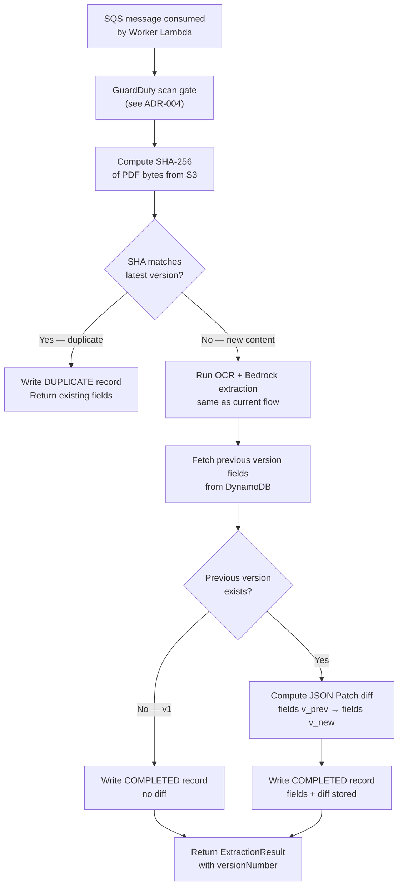

# ADR-007 — Document Version History

**Status:** Accepted

---

## Decision

**Track document versions using a stable `documentId` as the group identifier, with a sequential `versionNumber` per upload. Store SHA-256 per version for duplicate detection. Persist full extracted fields and a JSON Patch diff against the previous version in DynamoDB. Use S3 native versioning for binary storage.**

---

## Context

Tenants may upload multiple versions of the same document over time — a contract that gets amended, an invoice that is corrected and reissued, a CV updated after a promotion. Without version history, each upload is treated as an independent document with no relationship to its predecessors.

The goal is to allow:
- Viewing the full history of versions for a document
- Knowing what changed in the extracted fields between any two versions
- Detecting duplicate uploads (same content re-uploaded) without reprocessing

---

## Key Concepts

### Document vs Version

| Concept | Description | Identifier |
|---|---|---|
| **Document** | The stable entity — "the Acme Corp invoice" | `documentId` (chosen at first upload, never changes) |
| **Version** | A specific upload of that document | `versionNumber` — sequential integer starting at 1 |

`documentId` is generated at the first `POST /documents/prepare` call. Subsequent uploads of the same document pass the existing `documentId` — the backend creates a new version under that group.

### SHA-256

A SHA-256 hash of the PDF bytes is computed in the Lambda after the file is read from S3 (post-GuardDuty scan). It serves two purposes:

1. **Duplicate detection** — if the new upload's SHA matches the latest version's SHA, the content is identical; skip re-extraction and return the existing result.
2. **Audit trail** — each version record stores its SHA, making it possible to verify content integrity at any point.

### JSON Patch Diff

After extracting fields for a new version, the Lambda computes a **JSON Patch** (RFC 6902) diff against the previous version's fields. This diff is stored alongside the full fields in DynamoDB, enabling:

- "What changed between v1 and v2?" without reading both full records
- Lightweight audit log of field-level changes

---

## Options Considered for Binary Storage

### Option A — Custom S3 keys per version

Each version gets its own S3 object at a versioned path:

```
{tenantId}/documents/{documentId}/v{versionNumber}/{documentId}.pdf
```

**Strengths:** explicit, human-readable, independent lifecycle per version.  
**Weaknesses:** requires custom key construction logic; lifecycle rules must be managed manually.

### Option B — S3 native versioning

A single S3 key per document; S3 tracks the binary history automatically via version IDs:

```
{tenantId}/documents/{documentId}/current.pdf
```

**Strengths:** S3 manages the version stack; no key changes needed when a new version is uploaded; lifecycle rules apply to the key, not individual objects.  
**Weaknesses:** S3 version IDs are opaque strings, not sequential integers — must be correlated to `versionNumber` via DynamoDB.

### Decision

**Option A — Custom S3 keys per version.** The versioned path is explicit and independently addressable. It avoids dependence on S3 version ID opacity and makes per-version lifecycle management straightforward. The key construction is simple and deterministic.

---

## Storage Model

### S3

```
{tenantId}/documents/{documentId}/v{versionNumber}.pdf
{tenantId}/documents/{documentId}/v{versionNumber}.pdf.metadata.json
```

### DynamoDB

**Document group record** (one per `documentId`):

```
PK: TENANT#{tenantId}
SK: DOCUMENT#{documentId}
─────────────────────────────────────
documentId:      string
tenantId:        string
documentType:    string
latestVersion:   number
createdAt:       ISO 8601
updatedAt:       ISO 8601
```

**Version record** (one per upload):

```
PK: TENANT#{tenantId}
SK: DOCUMENT#{documentId}#VERSION#{zero-padded versionNumber}
─────────────────────────────────────
documentId:      string
versionNumber:   number
s3Key:           string  ({tenantId}/documents/{documentId}/v{n}.pdf)
sha256:          string  (hex-encoded SHA-256 of PDF bytes)
status:          PENDING | COMPLETED | REJECTED | DUPLICATE
fields:          map<string, string>  (extracted fields — absent if PENDING/REJECTED/DUPLICATE)
diffFromPrevious: JSON Patch array    (absent for v1 or if DUPLICATE)
processedAt:     ISO 8601
```

The SK uses zero-padded version numbers (`VERSION#0001`) to enable chronological DynamoDB range queries without a GSI.

---

## API Changes

### `POST /documents/prepare`

Gains an optional `documentId` parameter:

| Field | Type | Required | Description |
|---|---|---|---|
| `documentType` | string (enum) | Yes | One of: `Invoice`, `Contract`, `Report`, `Cv` |
| `documentId` | string (UUID) | No | If provided, creates a new version of an existing document. If absent, starts a new document (v1). |

**Response — `201 Created`**

```json
{
  "documentId": "3fa85f64-5717-4562-b3fc-2c963f66afa6",
  "versionNumber": 2,
  "uploadUrl": "https://s3.amazonaws.com/...",
  "expiresAt": "2026-07-01T10:15:00Z"
}
```

### `POST /documents/process`

Response gains `versionNumber` and `diffFromPrevious`:

```json
{
  "documentId": "3fa85f64-5717-4562-b3fc-2c963f66afa6",
  "versionNumber": 2,
  "tenantId": "tenant-abc",
  "documentType": "Invoice",
  "status": "COMPLETED",
  "fields": { "total_amount": "1800.00", "due_date": "2026-08-01" },
  "diffFromPrevious": [
    { "op": "replace", "path": "/total_amount", "value": "1800.00" },
    { "op": "replace", "path": "/due_date", "value": "2026-08-01" }
  ],
  "processedAt": "2026-07-01T10:20:00Z"
}
```

If the upload is a duplicate (SHA matches latest version), `status` is `DUPLICATE` and `fields` is omitted — the client is referred to the existing version.

### New endpoints

| Method | Route | Description |
|---|---|---|
| `GET` | `/documents/{documentId}/versions` | Lists all versions for a document (summary, no fields) |
| `GET` | `/documents/{documentId}/versions/{versionNumber}` | Returns full fields for a specific version |

---

## Processing Flow Changes



---

## Consequences

- **DynamoDB:** two item types per document (group record + version records). SK zero-padding supports range queries without a GSI.
- **IAM:** no new permissions required beyond existing S3 and DynamoDB access.
- **S3 key convention** changes from `{tenantId}/{year}/{month}/{documentId}.pdf` to `{tenantId}/documents/{documentId}/v{n}.pdf`. Existing data migration required for documents uploaded before this change.
- **`POST /documents/prepare`:** `documentId` becomes caller-supplied for new versions; the backend validates that the caller's `tenantId` owns the referenced `documentId`.
- **JSON Patch library:** a lightweight RFC 6902 implementation is required in the Lambda (e.g., `JsonPatch.Net` for .NET).

---

## Open Questions

- What is the maximum number of versions per document? Should there be a cap (e.g., 100) to bound DynamoDB item count and S3 storage?
- Should old versions be automatically archived to S3 Glacier after a configurable retention period?
- Should the `GET /documents/{documentId}/versions/{from}/diff/{to}` endpoint support arbitrary version pairs, or only consecutive versions?
