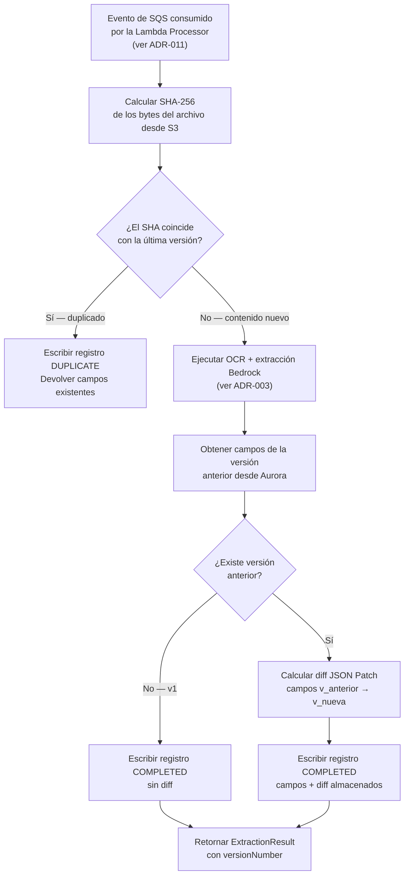

# ADR-007 — Historial de Versiones de Documentos

**Estado:** Aceptada — motor de almacenamiento actualizado, ver nota abajo.

---

## Decisión

**Rastrear las versiones de un documento usando un `documentId` estable como identificador de grupo, con un `versionNumber` secuencial por subida. Almacenar el SHA-256 de cada versión para detección de duplicados. Persistir los campos extraídos completos y un diff JSON Patch contra la versión anterior. Usar claves S3 explícitas por versión para el almacenamiento binario.**

**Motor de almacenamiento:** los registros descritos en este documento se persisten en **Aurora PostgreSQL** (tablas `documentos` y `documento_versiones`), no en DynamoDB — ver [ADR-008](008-data-storage-strategy.md) para el esquema completo.

---

## Contexto

Un mismo documento de un proceso puede subirse en varias versiones a lo largo del tiempo — un contrato que se enmienda, un escrito que se corrige y se vuelve a presentar. Sin historial de versiones, cada subida se trata como un documento independiente sin relación con sus predecesores.

El objetivo es permitir:
- Ver el historial completo de versiones de un documento.
- Saber qué cambió en los campos extraídos entre dos versiones cualesquiera.
- Detectar subidas duplicadas (mismo contenido resubido) sin reprocesar.

---

## Conceptos clave

### Documento vs. Versión

| Concepto | Descripción | Identificador |
|---|---|---|
| **Documento** | La entidad estable — "el contrato de arrendamiento del caso Acme" | `documentId` (elegido en la primera subida, nunca cambia) |
| **Versión** | Una subida específica de ese documento | `versionNumber` — entero secuencial que empieza en 1 |

`documentId` se genera en la primera llamada a `POST /documents/prepare`. Subidas subsiguientes del mismo documento pasan el `documentId` existente — el backend crea una nueva versión bajo ese grupo.

### SHA-256

Un hash SHA-256 de los bytes del archivo se calcula en la Lambda Processor después de leer el archivo desde S3 (posterior al escaneo de GuardDuty). Sirve para dos propósitos:

1. **Detección de duplicados** — si el SHA de la nueva subida coincide con el de la última versión, el contenido es idéntico; se omite la re-extracción y se devuelve el resultado existente.
2. **Rastro de auditoría** — cada registro de versión almacena su SHA, permitiendo verificar la integridad del contenido en cualquier momento.

### Diff JSON Patch

Después de extraer los campos de una nueva versión, la Lambda calcula un **JSON Patch** (RFC 6902) contra los campos de la versión anterior. Este diff se almacena junto con los campos completos, permitiendo:

- Responder "¿qué cambió entre v1 y v2?" sin leer ambos registros completos.
- Un registro de auditoría ligero de cambios a nivel de campo.

---

## Opciones consideradas para el almacenamiento binario

### Opción A — Claves S3 personalizadas por versión

Cada versión obtiene su propio objeto S3 en una ruta versionada:

```
{tenantId}/documents/{documentId}/v{versionNumber}.{ext}
```

**Fortalezas:** explícito, legible, ciclo de vida independiente por versión.
**Debilidades:** requiere lógica de construcción de clave; las reglas de ciclo de vida deben gestionarse manualmente.

### Opción B — Versionado nativo de S3

Una sola clave S3 por documento; S3 rastrea el historial binario automáticamente vía IDs de versión.

**Fortalezas:** S3 gestiona la pila de versiones automáticamente.
**Debilidades:** los IDs de versión de S3 son cadenas opacas, no enteros secuenciales — deben correlacionarse con `versionNumber` vía la base de datos.

### Decisión

**Opción A — Claves S3 personalizadas por versión.** La ruta versionada es explícita y direccionable de forma independiente. Evita depender de la opacidad de los IDs de versión de S3 y facilita la gestión de ciclo de vida por versión.

---

## Modelo de almacenamiento

### S3

```
{tenantId}/documents/{documentId}/v{versionNumber}.{ext}
{tenantId}/documents/{documentId}/v{versionNumber}.{ext}.metadata.json
```

`{ext}` se deriva del lado del servidor a partir del `contentType` validado (ver [ADR-005](005-upload-strategy.md#enfoque-elegido)) — nunca se asume `.pdf`.

### Aurora PostgreSQL

Ver [ADR-008](008-data-storage-strategy.md) para el esquema completo. Resumen relevante para versionado:

```sql
-- Registro de grupo de documento (uno por documento)
documentos (
  id             uuid primary key,
  empresa_id     uuid not null,
  proceso_id     uuid not null,
  tipo           text,        -- categoría del documento dentro del proceso (contrato, escrito, prueba, comunicación, otro)
  latest_version int not null default 0,
  creado_en      timestamptz,
  actualizado_en timestamptz
)

-- Registro de versión (uno por subida)
documento_versiones (
  id                 uuid primary key,
  documento_id       uuid references documentos(id),
  version_numero     int not null,
  content_type       text not null,   -- MIME type validado, ver lista de ADR-005
  s3_key             text not null,   -- {tenantId}/documents/{documentId}/v{n}.{ext}
  sha256             text not null,
  estado             text not null,   -- PENDING | COMPLETED | REJECTED | DUPLICATE
  campos             jsonb,           -- campos extraídos — ausente si PENDING/REJECTED/DUPLICATE
  diff_previo        jsonb,           -- JSON Patch — ausente para v1 o si DUPLICATE
  procesado_en       timestamptz
)
```

Un índice sobre `(documento_id, version_numero)` reemplaza la necesidad del zero-padding de claves de ordenamiento que se usaba en el diseño anterior basado en DynamoDB.

---

## Cambios de API

### `POST /documents/prepare`

Incluye un parámetro opcional `documentId`:

| Campo | Tipo | Requerido | Descripción |
|---|---|---|---|
| `documentId` | string (UUID) | No | Si se provee, crea una nueva versión de un documento existente. Si está ausente, inicia un nuevo documento (v1). |
| `procesoId` | string (UUID) | Sí | Proceso al que pertenece el documento |
| `tipoDocumento` | string | No | Categoría libre del documento dentro del proceso (p. ej. "contrato", "escrito", "prueba") |

**Respuesta — `201 Created`**

```json
{
  "documentId": "3fa85f64-5717-4562-b3fc-2c963f66afa6",
  "versionNumber": 2,
  "uploadUrl": "https://s3.amazonaws.com/...",
  "expiresAt": "2026-07-01T10:15:00Z"
}
```

### Nuevos endpoints

| Método | Ruta | Descripción |
|---|---|---|
| `GET` | `/documents/{documentId}/versions` | Lista todas las versiones de un documento (resumen, sin campos) |
| `GET` | `/documents/{documentId}/versions/{versionNumber}` | Devuelve los campos completos de una versión específica |

Ver `api-reference.md` para la superficie completa de la API en el dominio actual (Procesos, Clientes, Documentos, Usuarios, IA).

---

## Flujo de procesamiento


```mermaid
flowchart TD
    A["Evento de SQS consumido\npor la Lambda Processor\n(ver ADR-011)"] --> B["Calcular SHA-256\nde los bytes del archivo desde S3"]
    B --> C{"¿El SHA coincide\ncon la última versión?"}
    C -->|Sí — duplicado| D["Escribir registro DUPLICATE\nDevolver campos existentes"]
    C -->|No — contenido nuevo| E["Ejecutar OCR + extracción Bedrock\n(ver ADR-003)"]
    E --> F["Obtener campos de la versión\nanterior desde Aurora"]
    F --> G{"¿Existe versión\nanterior?"}
    G -->|No — v1| H["Escribir registro COMPLETED\nsin diff"]
    G -->|Sí| I["Calcular diff JSON Patch\ncampos v_anterior → v_nueva"]
    I --> J["Escribir registro COMPLETED\ncampos + diff almacenados"]
    H --> K["Retornar ExtractionResult\ncon versionNumber"]
    J --> K
```

---

## Consecuencias

- **Aurora:** dos tipos de registro (documento + versiones), con clave foránea entre ambos y un índice compuesto para ordenar versiones.
- **IAM:** sin permisos nuevos más allá del acceso existente a S3 y a Aurora (vía Secrets Manager para las credenciales de conexión).
- **Convención de clave S3** se mantiene sin cambios: `{tenantId}/documents/{documentId}/v{n}.{ext}`.
- **Librería JSON Patch:** se requiere una implementación ligera de RFC 6902 en la Lambda (p. ej. `JsonPatch.Net` para .NET).

---

## Preguntas abiertas

- ¿Cuál es el número máximo de versiones por documento? ¿Debería existir un tope para acotar el crecimiento de la tabla y del almacenamiento en S3?
- ¿Deberían archivarse automáticamente las versiones antiguas a S3 Glacier tras un período de retención configurable?
- ¿El endpoint de diff entre versiones debería soportar pares de versiones arbitrarios, o solo versiones consecutivas?
