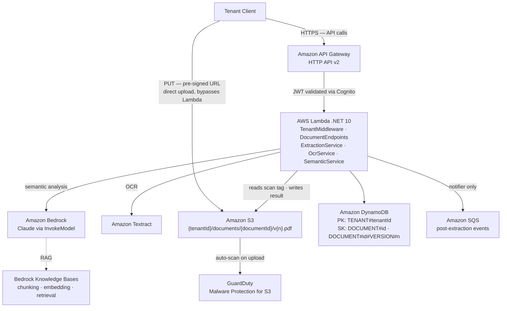

# Architecture

## Tech Stack

| Layer | Technology |
|---|---|
| Compute | AWS Lambda (.NET 10) |
| API Entry | Amazon API Gateway (HTTP API v2) |
| Identity | Amazon Cognito (JWT with `custom:tenantId` claim) |
| OCR | Amazon Textract + PdfPig (hybrid fast path) |
| AI Analysis | Amazon Bedrock — Claude via `InvokeModel` |
| RAG | Amazon Bedrock Knowledge Bases (chunking, embedding, retrieval) |
| Operational DB | Amazon DynamoDB |
| Document Storage | Amazon S3 |
| Notifications | Amazon SNS / SQS (post-extraction notifications) |
| Security | Amazon GuardDuty Malware Protection for S3 (upload scanning) |
| Observability | Amazon CloudWatch + AWS X-Ray + AWS Lambda Powertools |
| IaC | Terraform (HCL) — primary; AWS CDK scaffolding present but being phased out |
| Frontend | React 19, TypeScript, Vite, Feature-Sliced Design |
| Frontend IaC | Terraform (environments: dev / staging / production) |

## Component Map

## Multi-Tenancy Model

DocLens uses a **logical silo** approach: all tenants share the same infrastructure, but data is partitioned by `tenantId` at every layer.

| Layer | Isolation key |
|---|---|
| API / Auth | `custom:tenantId` claim in Cognito JWT |
| Middleware | `TenantMiddleware` resolves `TenantId` before any handler runs |
| S3 | Key prefix: `{tenantId}/documents/{documentId}/v{versionNumber}.pdf` |
| DynamoDB | Partition key: `TENANT#{tenantId}` |
| Bedrock Knowledge Bases | Metadata filter: `{ "tenantId": "..." }` on every `Retrieve` call |
| Logs | Structured log field `TenantId` on every log entry |

!!! danger "Critical rule"
    The `tenantId` filter on Knowledge Bases **must never be optional** — it is the only barrier preventing cross-tenant retrieval.

## Design Principles

- **Inside-out design:** core extraction logic is built first; infrastructure wiring is added second.
- **Interface + implementation pairs:** every service has an interface (`IOcrService`, `ISemanticAnalysisService`, `IDocumentExtractionService`) to enable mocking in tests and future substitution.
- **Scoped services, singleton AWS clients:** services are registered as `Scoped`; AWS SDK clients are `Singleton` via `AddAWSService<T>`.
- **Asynchronous extraction (event-driven):** `POST /documents/process` enqueues a job to SQS and returns `202 Accepted` immediately. A separate worker Lambda performs Textract + Bedrock extraction without API Gateway timeout pressure. The client polls `GET /documents/{id}/versions/{n}` for the result.
- **SQS as processing backbone:** the SQS queue decouples intake from extraction and provides retry isolation via a dead-letter queue. A second SQS queue is used for post-extraction notifications (e.g., email).

## OCR Strategy — Hybrid Fast Path

See [ADR-003](adrs/003-ocr-strategy.md) for the full analysis.

1. **PdfPig first** — attempts in-process extraction from the PDF byte stream (free, milliseconds, no network call).
2. **Evaluate result** — if extracted text is below a minimum threshold (~50 characters), the document is treated as image-based.
3. **Textract fallback** — only invoked when PdfPig yields insufficient text (scanned documents, photos of documents).

## RAG Strategy — Bedrock Knowledge Bases

See [ADR-001](adrs/001-rag-strategy.md) for the full analysis.

DocLens owns: document intake, OCR, S3 layout, metadata authoring, ingestion job triggering.
Bedrock Knowledge Bases owns: chunking (semantic strategy), embedding, vector store, index lifecycle.

Tenant isolation at the RAG layer is enforced via S3 metadata files and a mandatory `tenantId` filter on every `Retrieve` / `RetrieveAndGenerate` call.

## Upload Strategy — Pre-signed URL

See [ADR-005](adrs/005-upload-strategy.md) for the full analysis.

Clients upload documents directly to S3 using a short-lived pre-signed PUT URL, bypassing Lambda entirely. This avoids the 10 MB API Gateway payload limit and eliminates unnecessary data transfer through the compute layer.

1. Client calls `POST /documents/prepare` — optionally passes an existing `documentId` to create a new version; receives `{ documentId, versionNumber, uploadUrl }`.
2. Client PUTs the file directly to S3 using `uploadUrl` (15-minute TTL, `application/pdf` only).
3. Client calls `POST /documents/process` — intake Lambda enqueues a job to SQS and returns `202 Accepted` immediately.
4. Worker Lambda consumes the SQS message — handles the GuardDuty gate internally, computes SHA-256, runs extraction, and stores the diff against the previous version.
5. Client polls `GET /documents/{documentId}/versions/{versionNumber}` until status is no longer `PENDING`.

## Malware Scanning — GuardDuty

See [ADR-004](adrs/004-malware-scanning.md) for the full analysis.

GuardDuty Malware Protection for S3 scans every uploaded object automatically. The processing Lambda gates extraction on the `GuardDutyMalwareScanStatus` tag: `CLEAN` proceeds, `THREATS_FOUND` and `UNSCANNABLE` return `422`, and an absent tag (scan still running) returns `409`.

## Document Versioning

See [ADR-007](adrs/007-document-versioning.md) for the full analysis.

A `documentId` is the stable identifier for a document across all its versions. Each upload creates a new `versionNumber` (sequential integer) under the same `documentId`. The Lambda computes SHA-256 after the GuardDuty scan — identical content is flagged as `DUPLICATE` without re-extracting. After successful extraction, a JSON Patch diff (RFC 6902) against the previous version's fields is computed and stored alongside the full fields in DynamoDB.

| Concept | Detail |
|---|---|
| Stable ID | `documentId` — chosen at first upload, never changes |
| Version | `versionNumber` — sequential integer, starts at 1 |
| Duplicate detection | SHA-256 of PDF bytes compared against latest version |
| Diff | JSON Patch stored per version — shows what changed in extracted fields |
| S3 layout | `{tenantId}/documents/{documentId}/v{versionNumber}.pdf` |
| DynamoDB | Two item types per document: group record + one version record per upload |

## IaC Strategy

See [ADR-002](adrs/002-iac-strategy.md) for the full rationale.

- **Terraform (HCL)** is the primary IaC tool for all DocLens infrastructure.
- Terraform state: S3 backend + DynamoDB lock table.
- Terraform code lives in `infra/terraform/` (Lambda project) and `infra/` (Web template).
- AWS CDK scaffolding (`infra/src/DocLens.Infra/`) exists from early exploration and is being removed as Terraform coverage grows.
