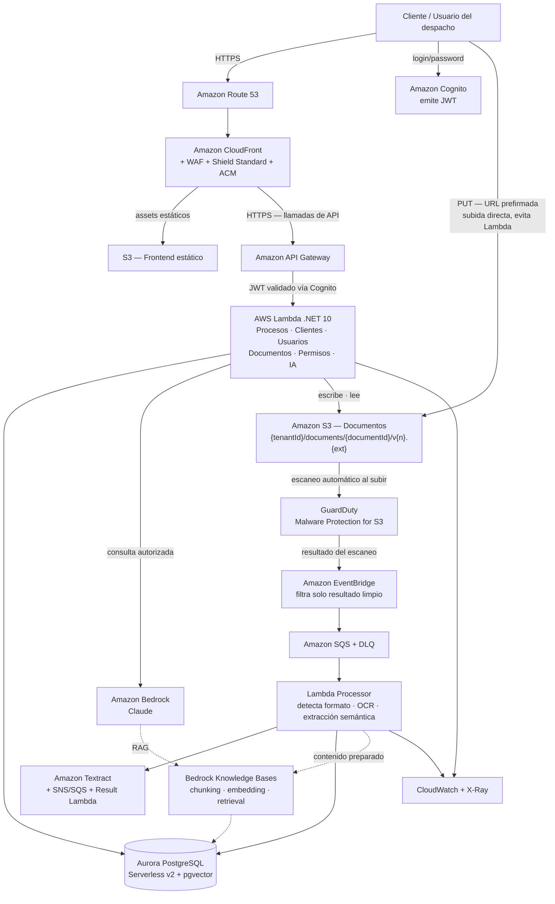
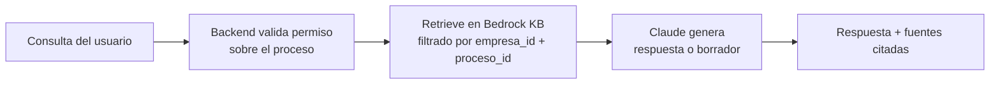

# Arquitectura

## Stack Tecnológico

| Capa | Tecnología |
|---|---|
| DNS | Amazon Route 53 |
| CDN / entrada de la app | Amazon CloudFront + AWS WAF + AWS Shield Standard + AWS Certificate Manager (ver [ADR-009](adrs/009-edge-network-strategy.md)) |
| Identidad | Amazon Cognito (JWT, expuesto directo a internet) |
| Frontend (hosting) | Amazon S3 (bucket privado, servido vía CloudFront) |
| Entrada de API | Amazon API Gateway |
| Cómputo | AWS Lambda (.NET 10) (ver [ADR-010](adrs/010-compute-strategy.md)) |
| Extracción de texto | Amazon Textract + PdfPig (ruta híbrida) (ver [ADR-003](adrs/003-ocr-strategy.md)) |
| Análisis de IA | Amazon Bedrock — Claude |
| RAG | Amazon Bedrock Knowledge Bases (chunking, embedding, retrieval) (ver [ADR-001](adrs/001-rag-strategy.md)) |
| Base de datos operativa + vector store | Amazon Aurora PostgreSQL Serverless v2 + `pgvector` (ver [ADR-008](adrs/008-data-storage-strategy.md)) |
| Almacenamiento de documentos | Amazon S3 |
| Disparo de procesamiento | GuardDuty Malware Protection + EventBridge (ver [ADR-011](adrs/011-document-processing-trigger.md)) |
| Desacople de carga | Amazon SQS + DLQ |
| Seguridad de subidas | Amazon GuardDuty Malware Protection for S3 (ver [ADR-004](adrs/004-malware-scanning.md)) |
| Observabilidad | Amazon CloudWatch + AWS X-Ray |
| IaC | Terraform (HCL) (ver [ADR-002](adrs/002-iac-strategy.md)) |
| CI/CD | GitHub Actions + OIDC |
| Frontend | React 19, TypeScript, Vite, Feature-Sliced Design |

## Mapa de Componentes


```mermaid
graph TD
    Client["Cliente / Usuario del despacho"]

    Client -->|"HTTPS"| R53["Amazon Route 53"]
    R53 --> CF["Amazon CloudFront\n+ WAF + Shield Standard + ACM"]
    CF -->|"assets estáticos"| S3Front["S3 — Frontend estático"]
    Client -->|"login/password"| Cognito["Amazon Cognito\nemite JWT"]

    CF -->|"HTTPS — llamadas de API"| APIGW["Amazon API Gateway"]
    Client -->|"PUT — URL prefirmada\nsubida directa, evita Lambda"| S3Docs

    APIGW -->|"JWT validado vía Cognito"| Lambda["AWS Lambda .NET 10\nProcesos · Clientes · Usuarios\nDocumentos · Permisos · IA"]

    Lambda --> Aurora[("Aurora PostgreSQL\nServerless v2 + pgvector")]
    Lambda -->|"consulta autorizada"| Bedrock["Amazon Bedrock\nClaude"]
    Bedrock -.->|"RAG"| KB["Bedrock Knowledge Bases\nchunking · embedding · retrieval"]
    KB -.-> Aurora

    Lambda -->|"escribe · lee"| S3Docs["Amazon S3 — Documentos\n{tenantId}/documents/{documentId}/v{n}.{ext}"]
    S3Docs -->|"escaneo automático al subir"| GD["GuardDuty\nMalware Protection for S3"]
    GD -->|"resultado del escaneo"| EB["Amazon EventBridge\nfiltra solo resultado limpio"]
    EB --> SQS["Amazon SQS + DLQ"]
    SQS --> Processor["Lambda Processor\ndetecta formato · OCR · extracción semántica"]
    Processor --> Textract["Amazon Textract\n+ SNS/SQS + Result Lambda"]
    Processor --> Aurora
    Processor -.->|"contenido preparado"| KB

    Lambda --> CW["CloudWatch + X-Ray"]
    Processor --> CW
```

## Modelo de Multi-Tenancy

DocLens sigue siendo una plataforma **SaaS multi-tenant**: cada despacho de abogados (empresa cliente de DocLens) es un tenant, con datos aislados a nivel lógico. Dentro de cada tenant vive el dominio del negocio del despacho — Clientes, Procesos, Documentos y Usuarios.

```
Tenant (empresa / despacho)
  ├── Usuarios internos (admin / no-admin)
  ├── Clientes
  │     └── Usuarios de cliente (consultan sus propios procesos)
  └── Procesos
        ├── Documentos (con versiones)
        └── Permisos (qué usuario accede a qué proceso)
```

| Capa | Clave de aislamiento |
|---|---|
| API / Auth | Claim `custom:tenantId` en el JWT de Cognito |
| Middleware | Resuelve el tenant antes de que corra cualquier handler |
| S3 | Prefijo de clave: `{tenantId}/documents/{documentId}/v{versionNumber}.{ext}` |
| Aurora | Columna `empresa_id` en cada tabla (ver [ADR-008](adrs/008-data-storage-strategy.md)) |
| Bedrock Knowledge Bases | Filtro de metadatos: `{ "empresa_id": "...", "proceso_id": "..." }` en cada llamada `Retrieve` |
| Logs | Campo estructurado `empresa_id` en cada entrada |

!!! danger "Regla crítica"
    El filtro `empresa_id` (y, cuando aplique, `proceso_id`) en Knowledge Bases **nunca debe ser opcional** — es la única barrera contra el acceso cruzado entre tenants y entre procesos de distintos clientes de un mismo despacho.

Dentro de un mismo tenant, los **permisos por proceso** determinan qué usuario interno o de cliente puede ver qué caso — ver la tabla `permisos` en [ADR-008](adrs/008-data-storage-strategy.md) y el endpoint de auditoría de accesos en `api-reference.md`.

## Principios de Diseño

- **Procesamiento asíncrono dirigido por eventos:** el procesamiento de documentos se dispara cuando GuardDuty confirma que el archivo está limpio — no por una llamada explícita del cliente (ver [ADR-011](adrs/011-document-processing-trigger.md)).
- **Sin agente autónomo en V1:** el flujo de IA es explícito y orquestado por el backend — autorizar, recuperar de la base de conocimiento, generar con Claude, devolver con fuentes (ver [ADR-012](adrs/012-no-autonomous-agent.md)).
- **Interfaz + implementación:** cada servicio tiene una interfaz para permitir mocking en pruebas y sustitución futura.
- **Servicios scoped, clientes de AWS singleton:** los servicios se registran como `Scoped`; los clientes del SDK de AWS son `Singleton` vía `AddAWSService<T>`.
- **SQS + DLQ como columna vertebral del procesamiento:** desacopla la recepción de eventos del procesamiento pesado y aísla los reintentos.

## Estrategia de OCR — Ruta Híbrida

Ver [ADR-003](adrs/003-ocr-strategy.md) para el análisis completo.

1. **PdfPig primero** — intenta la extracción en proceso desde el flujo de bytes del PDF (gratis, milisegundos, sin llamada de red).
2. **Evaluar el resultado** — si el texto extraído está bajo un umbral mínimo (~50 caracteres), el documento se trata como basado en imagen.
3. **Textract como respaldo** — solo se invoca cuando PdfPig produce texto insuficiente.

## Estrategia de RAG — Bedrock Knowledge Bases

Ver [ADR-001](adrs/001-rag-strategy.md) para el análisis completo.

DocLens es dueño de: ingesta de documentos, OCR, organización en S3, generación de metadatos, disparo del job de ingesta.
Bedrock Knowledge Bases es dueño de: chunking, embedding, y ciclo de vida del índice, usando Aurora + `pgvector` como vector store (ver [ADR-008](adrs/008-data-storage-strategy.md)).

## Estrategia de Subida — URL Prefirmada

Ver [ADR-005](adrs/005-upload-strategy.md) para el análisis completo.

Los clientes suben documentos directamente a S3 usando una URL PUT prefirmada de corta duración, evitando Lambda por completo.

1. El cliente llama a `POST /documents/prepare` — recibe `{ documentId, versionNumber, uploadUrl }`.
2. El cliente hace PUT del archivo directamente a S3 usando `uploadUrl` (TTL de 15 minutos).
3. GuardDuty escanea el objeto automáticamente.
4. Si el resultado es limpio, una regla de EventBridge dispara el procesamiento vía SQS — sin llamada adicional del cliente (ver [ADR-011](adrs/011-document-processing-trigger.md)).
5. El cliente sondea `GET /documents/{documentId}/versions/{versionNumber}` hasta que el estado deja de ser `PENDING`.

## Escaneo de Malware — GuardDuty + EventBridge

Ver [ADR-004](adrs/004-malware-scanning.md) y [ADR-011](adrs/011-document-processing-trigger.md) para el análisis completo.

GuardDuty Malware Protection for S3 escanea automáticamente cada objeto subido. El resultado del escaneo se publica como evento en EventBridge; una regla filtra y reenvía a SQS únicamente los resultados `CLEAN`. Un resultado `THREATS_FOUND` o `UNSCANNABLE` nunca llega a la cola de procesamiento — el registro correspondiente se marca `REJECTED` por una vía separada.

## Versionado de Documentos

Ver [ADR-007](adrs/007-document-versioning.md) para el análisis completo.

Un `documentId` es el identificador estable de un documento a través de todas sus versiones. Cada subida crea un `versionNumber` secuencial bajo el mismo `documentId`. La Lambda Processor calcula SHA-256 tras el escaneo de GuardDuty — contenido idéntico se marca como `DUPLICATE` sin re-extraer. Tras una extracción exitosa, se calcula y almacena un diff JSON Patch (RFC 6902) contra los campos de la versión anterior, junto con los campos completos, en Aurora.

## Base de Datos y Vector Store — Aurora + pgvector

Ver [ADR-008](adrs/008-data-storage-strategy.md) para el esquema completo.

Un único motor, Aurora PostgreSQL Serverless v2, almacena tanto los datos operativos (empresas, usuarios, clientes, procesos, documentos, permisos, auditoría) como el vector store de Bedrock Knowledge Bases (esquema `kb` dedicado, vía `pgvector`).

## IA / RAG — Flujo Explícito sin Agente

Ver [ADR-012](adrs/012-no-autonomous-agent.md) para el análisis completo.


```mermaid
flowchart LR
    A["Consulta del usuario"] --> B["Backend valida permiso\nsobre el proceso"]
    B --> C["Retrieve en Bedrock KB\nfiltrado por empresa_id + proceso_id"]
    C --> D["Claude genera\nrespuesta o borrador"]
    D --> E["Respuesta + fuentes citadas"]
```

No existe un servicio de "agente" independiente — todo el código de orquestación vive en el backend.

## Recuperación ante Desastres

Ver [ADR-013](adrs/013-disaster-recovery-strategy.md) para el análisis completo.

V1 opera en una única región (`eu-west-1`), sin despliegue activo multi-región. La recuperación se apoya en versionado/cifrado de S3, backups automáticos + Point-in-Time Recovery de Aurora, DLQ para trabajos no procesables, observabilidad vía CloudWatch, e infraestructura completamente reproducible mediante Terraform.

## Estrategia de Edge / Red

Ver [ADR-009](adrs/009-edge-network-strategy.md) para el análisis completo.

La capa de entrada es 100% nativa de AWS — Route 53, CloudFront, WAF y Shield Standard — sin un proveedor de borde externo como Cloudflare.

## Estrategia de Cómputo

Ver [ADR-010](adrs/010-compute-strategy.md) para el análisis completo.

API Gateway + Lambda, sin cómputo permanentemente activo (App Runner/ECS descartados para V1) — la carga es principalmente request-driven y el trabajo largo es asíncrono.

## Estrategia de IaC

Ver [ADR-002](adrs/002-iac-strategy.md) para la justificación completa.

- **Terraform (HCL)** es la herramienta principal de IaC para toda la infraestructura de DocLens: Route 53, CloudFront, WAF, S3, Cognito, API Gateway, Lambda, Aurora Serverless v2, EventBridge, SQS/DLQ, SNS, Textract, Bedrock Knowledge Bases, IAM, cifrado y observabilidad.
- Estado de Terraform: backend S3 + tabla de bloqueo DynamoDB.
- El código de Terraform vive en `infra/terraform/` (proyecto Lambda) y `infra/` (plantilla Web).

## Decisiones Arquitectónicas Clave

| Decisión | Alternativa descartada | Justificación | ADR |
|---|---|---|---|
| Edge nativo de AWS | Cloudflare | Menor complejidad, un solo proveedor | [009](adrs/009-edge-network-strategy.md) |
| API Gateway + Lambda | App Runner / ECS | No se necesita cómputo permanente | [010](adrs/010-compute-strategy.md) |
| Subida vía URL S3 prefirmada | Subida a través del backend | Durabilidad, tamaño y costo | [005](adrs/005-upload-strategy.md) |
| Procesamiento asíncrono | Procesamiento síncrono | Operaciones largas y resiliencia | [006](adrs/006-sync-vs-async-processing.md) / [011](adrs/011-document-processing-trigger.md) |
| OCR híbrido | Textract siempre | Costo y latencia | [003](adrs/003-ocr-strategy.md) |
| Bedrock Knowledge Bases | RAG manual | Menos código y mantenimiento | [001](adrs/001-rag-strategy.md) |
| Aurora + pgvector | Otro vector store separado | Reutiliza la base de datos existente, soportado por Bedrock | [008](adrs/008-data-storage-strategy.md) |
| Sin agente en V1 | Agente autónomo | El alcance actual no lo requiere | [012](adrs/012-no-autonomous-agent.md) |
| SQS + DLQ + idempotencia | Ejecución directa | Recuperación frente a fallos | [011](adrs/011-document-processing-trigger.md) |
| GuardDuty → EventBridge | Sondeo de tag con reintentos | Elimina la ventana de "escaneo aún no listo" | [011](adrs/011-document-processing-trigger.md) |
| Región única (`eu-west-1`) | Despliegue activo multi-región | Complejidad y costo no justificados para V1 | [013](adrs/013-disaster-recovery-strategy.md) |
