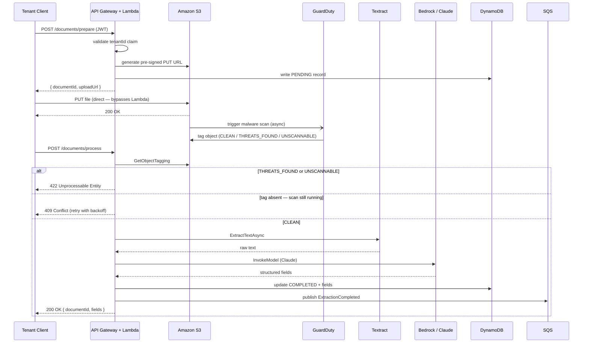
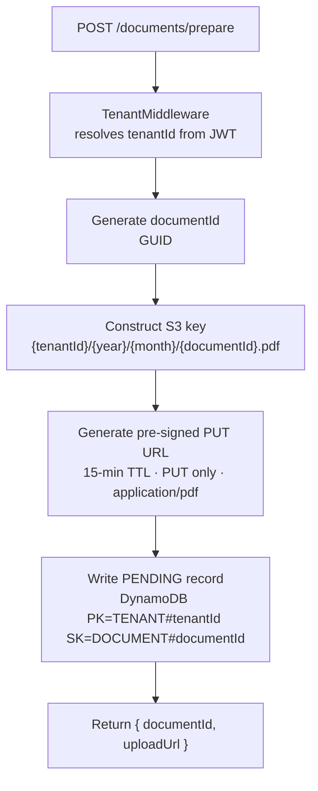
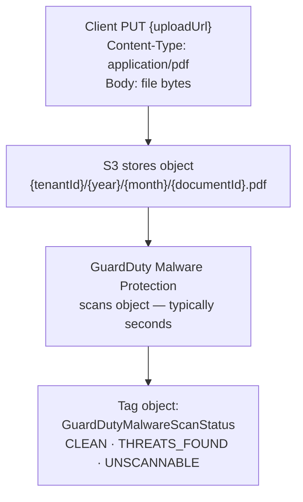
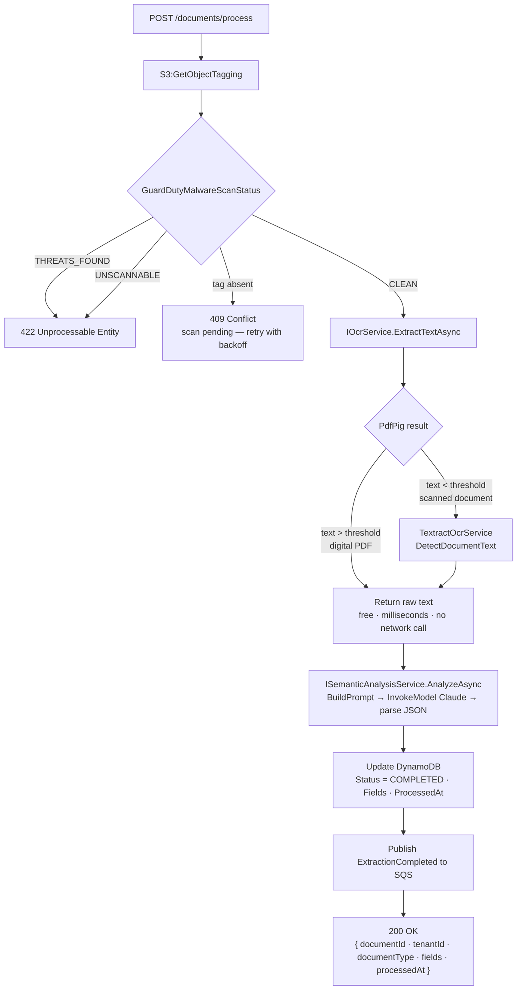
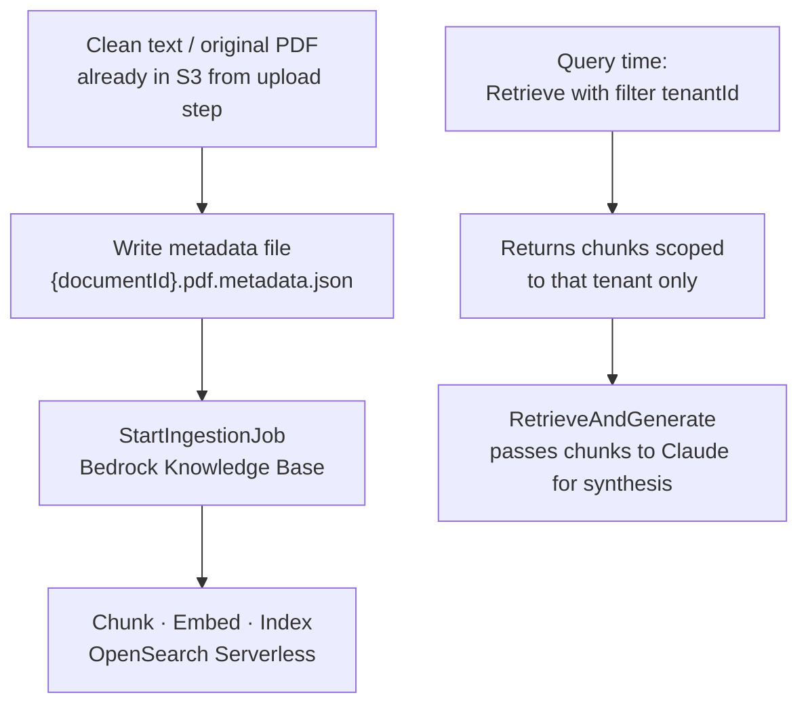
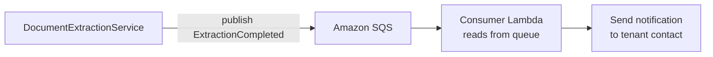

# Data Flow

## Full Upload and Processing Flow

The complete flow from a client uploading a document to receiving extraction results spans three steps: prepare, upload, and process.



> See [ADR-005](adrs/005-upload-strategy.md) for the upload mechanism rationale (pre-signed URL vs. backend proxy).
> See [ADR-004](adrs/004-malware-scanning.md) for the malware scanning gate logic.

---

## Step 1 — Prepare (`POST /documents/prepare`)



---

## Step 2 — Upload (Client → S3 directly)

The client PUTs the file bytes directly to the pre-signed URL. This call goes to S3, not to API Gateway or Lambda.



---

## Step 3 — Process (`POST /documents/process`)



> See [ADR-003](adrs/003-ocr-strategy.md) for the OCR hybrid fast path rationale.
> See [ADR-006](adrs/006-sync-vs-async-processing.md) for the synchronous processing decision.

---

## S3 Storage Convention

```
s3://<bucket>/{tenantId}/{year}/{month}/{documentId}.pdf
```

For RAG ingestion, a companion metadata file is written alongside the document:

```
s3://<bucket>/{tenantId}/{year}/{month}/{documentId}.pdf.metadata.json
```

```json
{
  "metadataAttributes": {
    "tenantId": "tenant-abc",
    "documentType": "invoice",
    "documentId": "doc-123"
  }
}
```

---

## DynamoDB Storage Convention

```
PK: TENANT#{tenantId}
SK: DOCUMENT#{documentId}
```

Document lifecycle states written to this record:

| Status | Written at |
|---|---|
| `PENDING` | `POST /documents/prepare` |
| `COMPLETED` | `POST /documents/process` — success |
| `REJECTED` | `POST /documents/process` — scan failed |

---

## RAG Ingestion Flow

After extraction, if the document needs to be indexed for semantic search:



See [ADR-001](adrs/001-rag-strategy.md) for the full RAG strategy rationale.

---

## Post-Extraction Notification Flow



!!! note
    SQS is used as a **notifier only** — it does not trigger the extraction pipeline.

---

## Key Data Contracts

### `ProcessDocumentRequest`

```csharp
record ProcessDocumentRequest(
    string DocumentId,
    string S3Key,
    DocumentType DocumentType
);
```

### `ExtractionResult`

```csharp
record ExtractionResult
{
    string DocumentId
    string TenantId
    DocumentType DocumentType
    Dictionary<string, string> Fields
    DateTimeOffset ProcessedAt
}
```

### `DocumentType` (enum)

Supported values: `Invoice`, `Contract`, `Report`, `CV`.

To add a new type: add the variant to `Models/DocumentType.cs` and add a matching `case` in `BedrockSemanticAnalysisService.BuildPrompt`.
