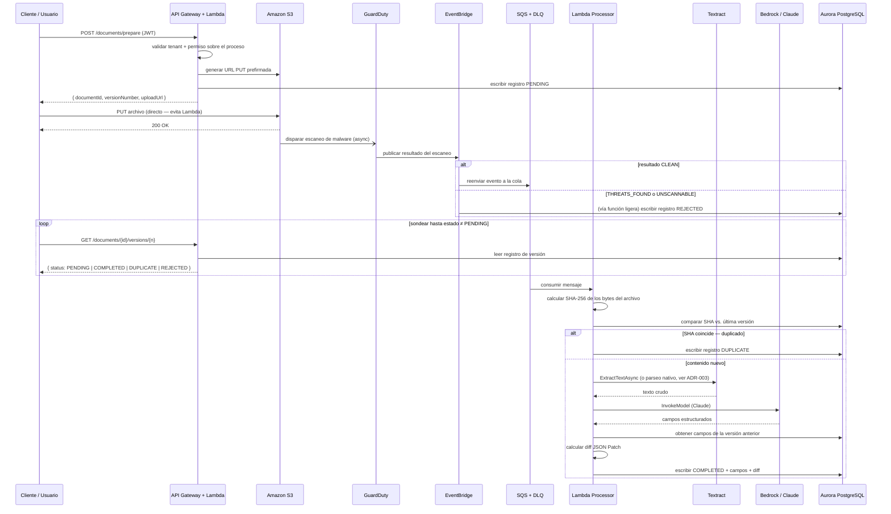
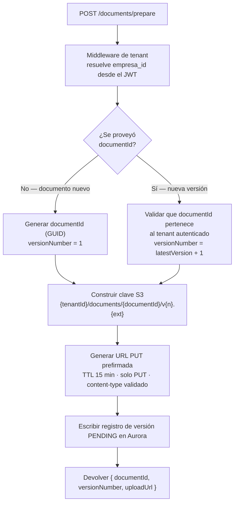
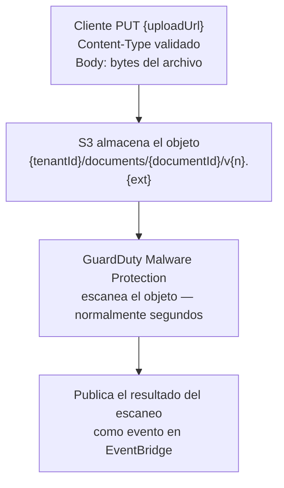
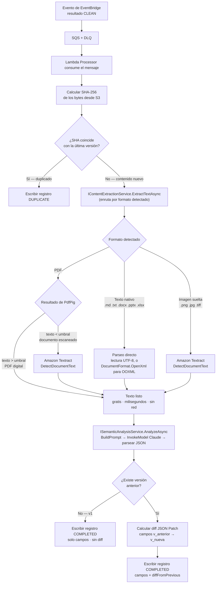
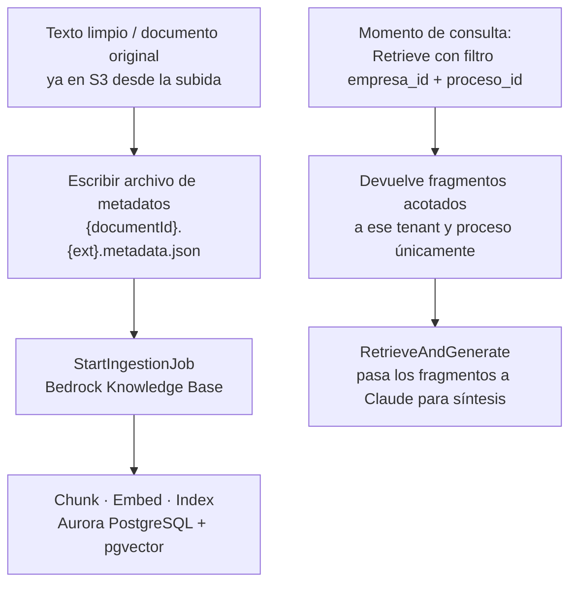
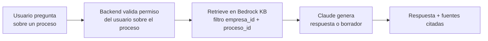

# Flujo de Datos

## Flujo Completo de Subida y Procesamiento

El flujo completo desde que un cliente sube un documento hasta que recibe el resultado de la extracción consta de: preparar, subir, y procesar automáticamente (sin llamada explícita del cliente para iniciar el procesamiento — ver [ADR-011](adrs/011-document-processing-trigger.md)).


```mermaid
sequenceDiagram
    participant C as Cliente / Usuario
    participant GW as API Gateway + Lambda
    participant S3 as Amazon S3
    participant GD as GuardDuty
    participant EB as EventBridge
    participant SQ as SQS + DLQ
    participant WK as Lambda Processor
    participant TX as Textract
    participant BD as Bedrock / Claude
    participant DB as Aurora PostgreSQL

    C->>GW: POST /documents/prepare (JWT)
    GW->>GW: validar tenant + permiso sobre el proceso
    GW->>S3: generar URL PUT prefirmada
    GW->>DB: escribir registro PENDING
    GW-->>C: { documentId, versionNumber, uploadUrl }

    C->>S3: PUT archivo (directo — evita Lambda)
    S3-->>C: 200 OK
    S3-)GD: disparar escaneo de malware (async)
    GD->>EB: publicar resultado del escaneo

    alt resultado CLEAN
        EB->>SQ: reenviar evento a la cola
    else THREATS_FOUND o UNSCANNABLE
        EB->>DB: (vía función ligera) escribir registro REJECTED
    end

    loop sondear hasta estado ≠ PENDING
        C->>GW: GET /documents/{id}/versions/{n}
        GW->>DB: leer registro de versión
        GW-->>C: { status: PENDING | COMPLETED | DUPLICATE | REJECTED }
    end

    SQ->>WK: consumir mensaje
    WK->>WK: calcular SHA-256 de los bytes del archivo
    WK->>DB: comparar SHA vs. última versión

    alt SHA coincide — duplicado
        WK->>DB: escribir registro DUPLICATE
    else contenido nuevo
        WK->>TX: ExtractTextAsync (o parseo nativo, ver ADR-003)
        TX-->>WK: texto crudo
        WK->>BD: InvokeModel (Claude)
        BD-->>WK: campos estructurados
        WK->>DB: obtener campos de la versión anterior
        WK->>WK: calcular diff JSON Patch
        WK->>DB: escribir COMPLETED + campos + diff
    end
```

> Ver [ADR-011](adrs/011-document-processing-trigger.md) para el mecanismo de disparo (GuardDuty → EventBridge → SQS).
> Ver [ADR-003](adrs/003-ocr-strategy.md) para la estrategia de enrutamiento de extracción de texto.

---

## Paso 1 — Preparar (`POST /documents/prepare`)


```mermaid
flowchart TD
    A["POST /documents/prepare"] --> B["Middleware de tenant\nresuelve empresa_id desde el JWT"]
    B --> C{"¿Se proveyó\ndocumentId?"}
    C -->|No — documento nuevo| D["Generar documentId (GUID)\nversionNumber = 1"]
    C -->|Sí — nueva versión| E["Validar que documentId pertenece\nal tenant autenticado\nversionNumber = latestVersion + 1"]
    D --> F["Construir clave S3\n{tenantId}/documents/{documentId}/v{n}.{ext}"]
    E --> F
    F --> G["Generar URL PUT prefirmada\nTTL 15 min · solo PUT · content-type validado"]
    G --> H["Escribir registro de versión PENDING en Aurora"]
    H --> I["Devolver { documentId, versionNumber, uploadUrl }"]
```

---

## Paso 2 — Subida (Cliente → S3 directamente)

El cliente hace PUT de los bytes del archivo directamente a la URL prefirmada. Esta llamada va a S3, no a API Gateway ni a Lambda.


```mermaid
flowchart TD
    A["Cliente PUT {uploadUrl}\nContent-Type validado\nBody: bytes del archivo"] --> B["S3 almacena el objeto\n{tenantId}/documents/{documentId}/v{n}.{ext}"]
    B --> C["GuardDuty Malware Protection\nescanea el objeto — normalmente segundos"]
    C --> D["Publica el resultado del escaneo\ncomo evento en EventBridge"]
```

---

## Paso 3 — Procesamiento (disparado por EventBridge, sin llamada del cliente)

Ver [ADR-011](adrs/011-document-processing-trigger.md) para la decisión completa. Una regla de EventBridge filtra el resultado del escaneo de GuardDuty y solo reenvía a SQS cuando el resultado es `CLEAN`. No existe un endpoint `/process` ni una Lambda de intake — el propio evento de escaneo limpio es el disparador.


```mermaid
flowchart TD
    A["Evento de EventBridge\nresultado CLEAN"] --> B["SQS + DLQ"]
    B --> C["Lambda Processor consume el mensaje"]
    C --> D["Calcular SHA-256\nde los bytes desde S3"]
    D --> E{"¿SHA coincide\ncon la última versión?"}
    E -->|Sí — duplicado| F["Escribir registro DUPLICATE"]
    E -->|No — contenido nuevo| G["IContentExtractionService.ExtractTextAsync\n(enruta por formato detectado)"]

    G --> G2{"Formato detectado"}

    G2 -->|PDF| H{"Resultado de PdfPig"}
    H -->|"texto > umbral\nPDF digital"| I["Texto listo\ngratis · milisegundos · sin red"]
    H -->|"texto < umbral\ndocumento escaneado"| J["Amazon Textract\nDetectDocumentText"]
    J --> I

    G2 -->|"Texto nativo\n.md .txt .docx .pptx .xlsx"| K["Parseo directo\nlectura UTF-8, o\nDocumentFormat.OpenXml para OOXML"]
    K --> I

    G2 -->|"Imagen suelta\n.png .jpg .tiff"| L["Amazon Textract\nDetectDocumentText"]
    L --> I

    I --> M["ISemanticAnalysisService.AnalyzeAsync\nBuildPrompt → InvokeModel Claude → parsear JSON"]
    M --> N{"¿Existe versión\nanterior?"}
    N -->|No — v1| O["Escribir registro COMPLETED\nsolo campos · sin diff"]
    N -->|Sí| P["Calcular diff JSON Patch\ncampos v_anterior → v_nueva"]
    P --> Q["Escribir registro COMPLETED\ncampos + diffFromPrevious"]
```

Un resultado `THREATS_FOUND` o `UNSCANNABLE` de GuardDuty no genera un evento reenviado a esta cola — se maneja por una vía separada que escribe directamente el registro `REJECTED` (ver [ADR-004](adrs/004-malware-scanning.md) y [ADR-011](adrs/011-document-processing-trigger.md)).

> Ver [ADR-003](adrs/003-ocr-strategy.md) para la estrategia de enrutamiento de extracción de texto (ruta híbrida de PDF, parseo de texto nativo, y OCR de imágenes).

---

## Convención de Almacenamiento en S3

```
s3://<bucket>/{tenantId}/documents/{documentId}/v{versionNumber}.{ext}
```

`{ext}` se deriva del lado del servidor a partir del `contentType` validado en la subida — ver la lista de formatos soportados en [ADR-005](adrs/005-upload-strategy.md#formatos-soportados-lista-permitida). Nunca se asume `.pdf`.

Para la ingesta a RAG, se escribe un archivo de metadatos complementario junto al documento:

```
s3://<bucket>/{tenantId}/documents/{documentId}/v{versionNumber}.{ext}.metadata.json
```

```json
{
  "metadataAttributes": {
    "empresa_id": "tenant-abc",
    "proceso_id": "proceso-123",
    "documento_id": "doc-456"
  }
}
```

---

## Convención de Almacenamiento en Aurora PostgreSQL

Ver [ADR-008](adrs/008-data-storage-strategy.md) para el esquema completo. Resumen de las tablas centrales del pipeline documental:

```
empresas             -- un tenant por fila
usuarios             -- internos (admin/no-admin) y de cliente
clientes             -- clientes del despacho, asociados a procesos
procesos             -- casos legales
documentos           -- grupo de documento (uno por documentId)
documento_versiones  -- una fila por subida (versionNumber, sha256, estado, campos, diff)
permisos             -- qué usuario accede a qué proceso
audit_log            -- auditoría de accesos
```

**Estados del ciclo de vida de una versión de documento:**

| Estado | Escrito en |
|---|---|
| `PENDING` | `POST /documents/prepare` |
| `COMPLETED` | Tras extracción exitosa (Lambda Processor) |
| `DUPLICATE` | El SHA coincide con la versión anterior |
| `REJECTED` | GuardDuty reportó `THREATS_FOUND` o `UNSCANNABLE` |

---

## Flujo de Ingesta a RAG

Después de la extracción, si el documento debe indexarse para búsqueda semántica:


```mermaid
flowchart TD
    A["Texto limpio / documento original\nya en S3 desde la subida"] --> B["Escribir archivo de metadatos\n{documentId}.{ext}.metadata.json"]
    B --> C["StartIngestionJob\nBedrock Knowledge Base"]
    C --> D["Chunk · Embed · Index\nAurora PostgreSQL + pgvector"]

    E["Momento de consulta:\nRetrieve con filtro empresa_id + proceso_id"] --> F["Devuelve fragmentos acotados\na ese tenant y proceso únicamente"]
    F --> G["RetrieveAndGenerate\npasa los fragmentos a Claude para síntesis"]
```

Ver [ADR-001](adrs/001-rag-strategy.md) para la estrategia completa de RAG y [ADR-008](adrs/008-data-storage-strategy.md) para el vector store.

---

## Flujo de Consulta de IA (sin agente)


```mermaid
flowchart LR
    A["Usuario pregunta\nsobre un proceso"] --> B["Backend valida permiso\ndel usuario sobre el proceso"]
    B --> C["Retrieve en Bedrock KB\nfiltro empresa_id + proceso_id"]
    C --> D["Claude genera\nrespuesta o borrador"]
    D --> E["Respuesta + fuentes citadas"]
```

Ver [ADR-012](adrs/012-no-autonomous-agent.md) para la decisión de no usar un agente autónomo.

---

## Contratos de Datos Clave

### `Proceso`

```csharp
record Proceso(
    Guid Id,
    Guid EmpresaId,
    Guid? ClienteId,
    string Titulo,
    string Estado,
    DateTimeOffset CreadoEn,
    DateTimeOffset ActualizadoEn
);
```

### `Cliente`

```csharp
record Cliente(
    Guid Id,
    Guid EmpresaId,
    string Nombre,
    DateTimeOffset CreadoEn
);
```

### `Documento` / `DocumentoVersion`

```csharp
record Documento(
    Guid Id,
    Guid EmpresaId,
    Guid ProcesoId,
    string? Tipo,
    int LatestVersion
);

record DocumentoVersion(
    Guid Id,
    Guid DocumentoId,
    int VersionNumero,
    string ContentType,
    string S3Key,
    string Sha256,
    string Estado,
    Dictionary<string, string>? Campos,
    JsonPatchDocument? DiffPrevio,
    DateTimeOffset? ProcesadoEn
);
```

### `RespuestaIA`

```csharp
record RespuestaIA(
    string Respuesta,
    IReadOnlyList<FuenteCitada> Fuentes
);

record FuenteCitada(
    Guid DocumentoId,
    int VersionNumero,
    string FragmentoTexto
);
```
